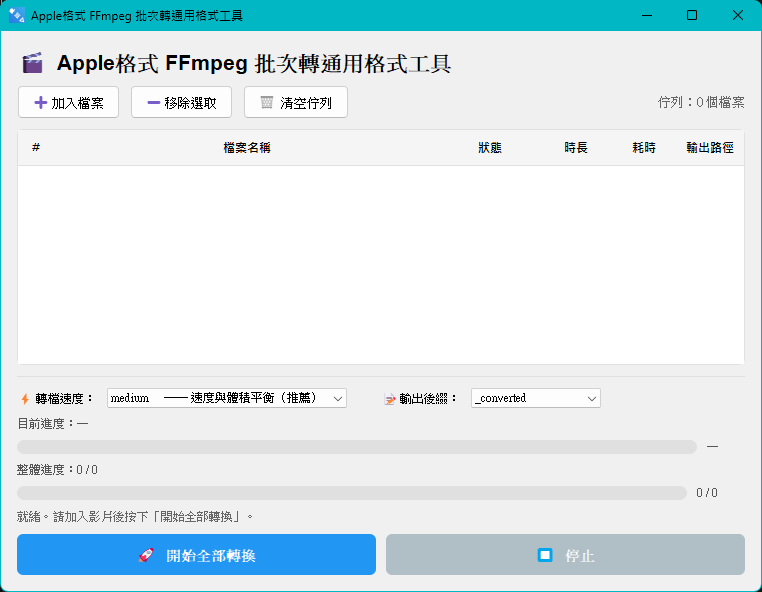

# Apple 格式批次轉換通用格式工具


這是一個基於 `PyQt5` 與 `FFmpeg` 的桌面 GUI 工具，用於將 Apple 影片格式批次轉換為更通用、兼容的 `H.264 + AAC` MP4 檔案。

## 開發目的
解決 Apple 影片格式於內嵌 PowerPoint 中時`無法正常嵌入`的問題。  
（對於已嵌入但無法正常顯示的媒體，請嘗試使用 PowerPoint 中的`最佳化媒體相容性`功能解決）

## 揭露
本人是廢物，程式碼皆為LLM撰寫。

## 截圖


## 主要功能

- 加入多個影片檔案進行批次轉換
- 逐檔、整體雙進度條顯示
- 轉檔速度選項：`ultrafast`、`medium`、`veryslow` (速度越快轉檔後體積越大)
- 設定輸出檔案後綴
- 支援停止/取消目前轉檔工作
- 顯示每個檔案的狀態、耗時與輸出檔名

## 使用說明

前往 [Releases 頁面](https://github.com/dalabonba/apple_to_compatibility_ffmpeg/releases) 下載已打包的版本。

1. 點選「➕ 加入檔案」選擇要轉換的影片
2. 選擇轉檔預設速度
3. 選擇輸出後綴（或使用原檔名輸出）
4. 點選「🚀 開始全部轉換」開始批次轉換
5. 若要中斷，點選「⏹ 停止」
6. 若要移除已加入的檔案，使用「➖ 移除選取」或「🗑 清空佇列」

## 注意事項

- 此程式依賴外部 `ffmpeg`，若系統找不到 `ffmpeg`，程式會顯示錯誤。
- 於 cmd 或 PowerShell 執行以下指令確認系統是否有安裝`ffmpeg`
    ```powershell
    ffmpeg -version
    ```
- 若要安裝`ffmpeg`，請於 cmd 或 PowerShell 執行
    ```powershell
    winget install ffmpeg
    ```

- 目前設計以 Windows 為主要執行環境。

## 輸出行為

- 預設輸出為 `MP4` 格式
- 影片編碼：`libx264`
- 色彩格式：`yuv420p`
- 音訊編碼：`aac`
- 輸出檔名會加上`後綴選項`再加上 `.mp4`


# 開發者資訊

以下針對開發者與維護者，說明專案環境、依賴、檔案結構與執行方式。

## 專案概述

- 主程式：`apple_to_compatibility.py`
- 這是一個使用 PyQt5 實現的桌面 GUI 應用，透過 `ffmpeg` 批次轉換 Apple 影片格式為兼容的 MP4。

## 開發環境

- Python 3.8+（建議使用最新穩定版本）
- Windows 為主要開發與執行平台

## 依賴

- `PyQt5`
- `ffmpeg` 可執行檔已安裝並加入系統 `PATH`

### 安裝套件

```powershell
pip install PyQt5
```

### 確認 ffmpeg

```powershell
ffmpeg -version
```
若無安裝 ↓

### 安裝ffmpeg
```powershell
winget install ffmpeg
```

## 本地執行

在專案目錄下執行：

```powershell
python apple_to_compatibility.py
```

## 檔案結構

- `apple_to_compatibility.py`：主程式，包含 GUI 與轉檔流程

## 重要程式區塊

- `FFmpegWorker`：負責在背景執行 `ffmpeg`，並透過訊號回報進度與完成狀態
- `BatchConverterUI`：建立 GUI 介面、管理檔案佇列、更新進度與狀態顯示
- `get_video_duration()`：取得影片時長，用於計算進度百分比
- `get_icon()`：載入視窗圖示

## 開發建議

- 若要調整轉檔參數，請修改 `BatchConverterUI._process_next()` 中 `ffmpeg` 命令列
- 若要改進進度顯示，可優化 `FFmpegWorker.run()` 的解析邏輯
